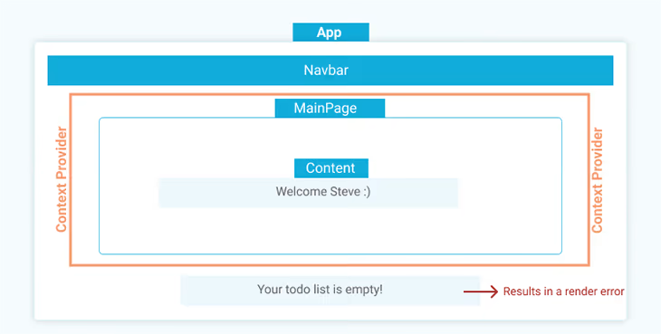

# React 02

Created: August 9, 2022 7:38 PM
Status: Open
Updated: August 16, 2022 4:35 PM

## Context API

The **context API** in React lets you pass props from children to the parent component.

---

It solves the problem of moving the props to the parent and passing all the way down (props journey). You have to create a `createContect()` for every component that you want to have access to the same state.

```jsx
import {createContext, useState} from 'react';
const VarContext = createContext();
```

We then create a  `VarProvider` function. Inside you write the Context tag  (`createContect`) followed by the `Provider` method. This special function provides access to our `value`(this attribute can assume **any data**) to any component **around** (parent/siblings).

```jsx
export function VarProvider ({children}){
	return (
		<VarContext.Provider value={{someVar, maybeFunc}}>
			{children}
		</VarContext.Provider>
	)
}
export default VarContext
```

`props.children` is a special prop automatically passed to every component. It represents all the content between an opening and closing tag 

In the other component you want to import the context, you have to:

```jsx
import {useContext} from 'react';
import VarContext from 'CartContext';

const {someVar} = useContext(VarContext)
```

You don’t have to pass any props. You simply *‘import’* the **value you need** by creating a new variable object, named as the values you need to use. 

### Problems with Context API

When a context.provider is wrapped over multiple components, we **implicitly pass** whatever state or data(value) is store in that provider to the children components it wraps.

We don’t *literally pass* the state to these components - not until we initiate an actual `useContext` Hook - but we have implicitly made these components `dependent` on the state provided by context provider.

The problems stems from trying to reuse any of these components outside the boundaries of our context.provider. The component first tries to confirm whether that implicit state provided by the context.provider still exists before rendering. When it doesn’t find this state, it throws a **render error**.

```jsx
import {createContext, useContext} from 'react';

const userContext = createContext();
function App(){
	return (
		<>
			<div>
				<Navbar />
				<userContext.Provider value={{ user: 'Steve' }}>
					<MainPage />
				</userContext.Provider>
			</div>
			<Message /> //error
		<>
	);
}
export default App;

function Navbar() {
	return <nav style={{ color:'#fff'}}>Demo App </nav>;	
}

function MainPage(){
	return(
		<div>
			<h3>Main Page</h3>
			<Content />
		</div>
	);
}

function Content(){
	return (
		<div>
			<Message />
		</div>
	);
}

function Message () {
	const {user} = useContext(useContext);
	return <p>Welcome {user} </p>;
}
```

### Example

The output would throw an error:
TypeError: Cannot destructure property ‘user’ of ‘Object(…)(…)’ as it is undefined.

Any attempt to do this will also lead to a render error because the `Message` component is now dependent on the `user` object in the context.provider’s state.

Attempts to reach into it for any existing `user` object provided by the context provider will fail.

Some would suggest bypassing the issue by wrapping the entire app with the context (*children*). That would be fine with smaller apps, but with larger complex apps, this would not be a practical solution as we often want to score multiple context providers in our app, depending on what needs to be managed.



Another of the main issues with Context API is that it uses a comparison algorithm that compares the value of its current state to any update it receives, and whenever a change occurs, the Context API broadcasts this change to every component consuming its provider, which in turn results in a re-render of all these components, ***regardless of whether the change affects them or not**.*

---

## Component Composition

When building React applications, we do so by building multiple reusable components that can be viewed almost like independent Lego blocks. Each block (component) is the considered to be one piece of our final interface - which, when assemblde or composed together, form the complete inerface of our application.

This process of assembling components as Lego block is know as **Component composition**. You’ve probably used component composition without recognizing it for what it is: an alternative for managing the state of our application. We’ll focus mainly on two types of component composition in this article:

### Container Components

*Everything in JavaScript (except privimitive data) is **objects***, including React component. These can contain different varieties of properties, including other components. There are two ways of achieving this feat:

1. By **explicitly passing one or more components** to another component as that component prop, which can then be extracted and rendered within that comp.
2. By **wrapping a parent component around one or more children** component, and then catching these children components using the default children prop.

Passing one components to another:

```jsx
import {useState} from 'react';

const App = () =>{
	const [data,setData] = useState('some state');
	return <ComponentOne ComponentTwo={<ComponentTwo data={data} />} />;
} 

const ComponentOne = ({ComponentTwo}){
	return (
		<div>
			<p>This is Component1, it receives Component2 as a prop and renders it </p>
		{ComponentTwo}
		</div>
	);
}

const ComponentTwo = ({data}) {
	return <h3>This is Component2 with the state {data} </h3>;
}
```

Rather than nesting components within components, we can simply lift these components to our **root App**, and then manually pass the intended child components to the parent component with the intended data attached directly to the child. In this way, the parent component will render it as a prop.

---

Wrapping a parent around the children:

```jsx
const App = () =>{
	const [data,setData] = useState('some state');
	return (
		<ParentComponent>
			<ComponentOne>
				<ComponentTwo data={data} />
			</ComponentOne>
		</ParentComponent>
	):
} 

const ParentComponent = ({children}) => {
	return <div>{children}</div>; //<ComponentOne </ComponentTwo> />
}

const ComponentOne = ({children}) => {
	return (
		<>
			<p>This is Component1, it receives Component2 as a child and renders it</p>
			{children} //ComponentTwo
		</>
	)

const ComponentTwo = ({data}) =>{
	return <h3>This is ComponentTwo with the received {data}</h3>
}
```

The code is self-explanatory. Whenever we wrap a component around another, *the wrapping component becomes a parent of the wrapped one*. The child component can then be received within the parent component using the default `children` prop, which is responsible for rendering child components.

---

### Specialized Components

A **specialized component** is a generic component that is conditionally created to render specialized variants of itself by passing in props that match the conditions for a specific variant.

This form of component composition **doesn’t solve prop drilling**, but *is more concerned with reusability and creating fewer components*, which can effeciently play a key role in composing a stateful interface when mixed with container components.

```jsx
const App = () => {
  return (
    <PopupModal title="Welcome" message="A popup modal">
      <UniqueContent/>
    </PopupModal>
  );
}

const PopupModal = ({title, message, children}) => {
  return (
    <div>
      <h1 className="title">{title}</h1>
      <p className="message">{message}</p>
      {children && children}
    </div>
  );
}

const UniqueContent = () => {
  return<div>Unique Markup</div>
}
```

---

### Component Composition App

```jsx
import {useState} from 'react';

const App = () => {
	const [user, setUser] = useState({name: "Steve" });
	return (
		<>
			<div>
				<Navbar />
				<MainPage content = {
					<Content message={
						<Message user={user}/> }
					/> }
				/>
			</div>
		<>
	);
}
export default App;

const Navbar = () => {
	return <nav style={{ color:'#fff'}}>Demo App </nav>;	
}

const MainPage = ({content}) => {
	return(
		<div>
			<h3>Main Page</h3>
			{content}
		</div>
	);
}

const Content ({message}) {
	return <div>{message}</div>
}

const Message = ({user}) => {
	return <p>Welcome {user} </p>;
}
```

### Old useContext App

```jsx
import {createContext, useContext} from 'react';

const userContext = createContext();
function App(){
	return (
		<>
			<div>
				<Navbar />
				<userContext.Provider value={{ user: 'Steve' }}>
					<MainPage />
				</userContext.Provider>
			</div>
			<Message /> //error
		<>
	);
}
export default App;

function Navbar() {
	return <nav style={{ color:'#fff'}}>Demo App </nav>;	
}

function MainPage(){
	return(
		<div>
			<h3>Main Page</h3>
			<Content />
		</div>
	);
}

function Content(){
	return (
		<div>
			<Message />
		</div>
	);
}

function Message () {
	const {user} = useContext(useContext);
	return <p>Welcome {user} </p>;
}
```

---

Something

---

<aside>
💡

</aside>

 Something

---